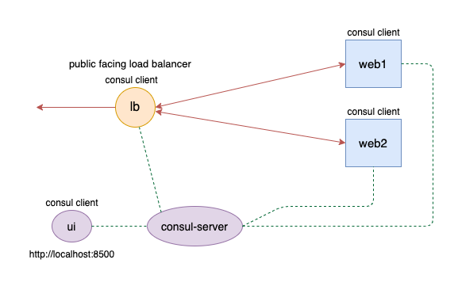
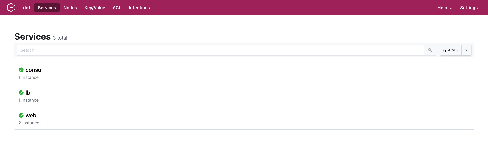

# Vagrant Consul Lab Cluster
This is a Consul lab cluster launched by Vagrant, the main purpose is to explore, practice Consul concepts and features:
- Monitor nodes
- Service discovery
- Dynamic config with Consul template
- Config via Key/Value store
- Health checking

The code is inspired and modified from [consul-getting-started](https://github.com/g0t4/consul-getting-started).

## Architecture


After setup, there are 5 virtual machines running locally in host:
- consul-server
- lb (HAProxy load balancer)
- web1 (Nginx)
- web2 (Nginx)
- ui (Consul web UI)

Run `vagrant status` to see the status
```bash
Current machine states:

consul-server             running (virtualbox)
lb                        running (virtualbox)
web1                      running (virtualbox)
web2                      running (virtualbox)
ui                        running (virtualbox)
```

There is 1 consul server and 4 consul clients (lb, web1, web2, ui).

The `lb` node has HAProxy load balancer that is public facing, it will cycling through `web1` and `web2` which hosts Nginx web server. `ui` node is dedicated for displaying consul web UI, no other services running on it. To access the Consul UI, open browser and type `http://localhost:8500`, you will see something similar like this:


The box image used here is:
```
config.vm.box = "wesmcclure/ubuntu1404-docker"
config.vm.box_version = "2.0.18"
```
If you switch to other compatible images, be sure the firewall is closed or you need to set the rules for port forwarding work properly.

Glossary: https://github.com/chengdol/vagrant-consul/blob/master/glossary.md

# Prerequisite
Use latest version is fine.
There are 5 virtual machines, each will consume 512MB memory and 1 CPU.

Download and install Vagrant
- https://www.vagrantup.com/downloads

Download and install VirtualBox:
- https://www.virtualbox.org/wiki/Downloads

# Procedure
In the demo code, Consul version is `1.8.0`, Consul template version is `0.25.0`. You can update version in `provision/install.consul.sh` and `provision/install.consul-template.sh` respectively.

First git clone or download the code:
```bash
git clone https://github.com/chengdol/vagrant-consul.git ~/vagrant-consul
cd ~/vagrant-consul
```

Launch Vagrant by running:
```bash
vagrant up
```
It will take several mintues to initialize the cluster to be ready.

To ssh into virtual machine, in your terminal run `vagrant ssh [machine name]`, for example:
```bash
vagrant ssh consul-server
vagrant ssh web1
vagrant ssh lb
```

Delete all virtual machines:
```bash
vagrant destroy -f
```
